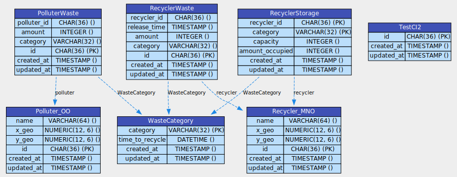

# Как разварачивать

## A) "Prod mode" - через Dockercompose

просто взять файл docker-compose.yml и запустить:\
docker compose up

## B) "Dev mode"

#### 1. разворачивание СУБД\

- поднять контейнер с postgres и передать переменные среды для создания БД Atom_eco с дефолтной у/з:\
    - POSTGRES_PASSWORD: root,\
    - POSTGRES_USER: root,\
    - POSTGRES_DB: Atom_eco

#### 2. создание venv и установка пакетов

python3 -m venv myenv\
source myenv/bin/activate\
pip install -r req.txt

  

**Warning\**
- пакет psycopg2 (psycopg2-binary уже) периодически устаревает/переименовывается - что даёт ошибку при попытке скачать пакеты из req.txt\
- при возниконовении ошибки с его установкой нужно переименовать его на акутальную версию - см. рекомендации из вывода консоли / гугл

  

#### 3. запуск приложения

python3 mock_tables.py # заполнить таблицы мок-данными\
python3 main.py        # запустить приложение

  
  
# Как использовать

#### Добавление сущностей 
- должно быть через API-"ручки" (можно на http://127.0.0.1:8001/api/v1.0/docs посмотреть), не через админку - она для фронта только

#### Увидеть и добавить сущности удобно через Swager UI - http://127.0.0.1:8001/docs

также можно добавить новых отходов организаций и ячеек хранения через вызов asyncio.run(MockAtomEco.OO_MNO_wastes_populate()) из mock_tables.py, но тогда нужно перезагрузить main.py т.к. у моков нет IPC синхронизации с демоном, в отличии от ручек API по добавлению сущностей\

#### Просмотр работы приложения
в админке http://127.0.0.1:8001/api/v1.0/admin/ (как фронт у меня) можно посмотреть на:
- очередь отходов организаций(PolluterWastes),\
- заполненность мест накопления отходов (Recycler Storages),\ 
- какие отходы сейчас находятся в хранилищах и сколько им ещё осталось до полной пререработки (Recycler Wastes)
  

#### Технологические фичи

##### 1. Контейнеризация: Docker, docker-compose
- настроена сборка как отдельного контейнера с приложением (Docker)\
- так и с инфраструктурой для него (docker-compose)

##### 2. CI 
Jobs :
1. автогенерация рисунка со схемой связей таблиц БД: 
- при успешном прохождении всех джоб наступает джоба "Draw_DB_diagram" - генерируется актуальная схема таблиц и затем пушится в репозиторий в "Push Artifacts" 

(Туду х2-xn)
2. автоформатирование кода - новая джоба 
3. юнит тесты в джобе "Unit_tests"

* CI настроен для workflow, запущенных *с авторизацией по ssh-ключам* (триггеры: push/pull request)\ 
** для настройки других типов авторизации, например, PAT - см. шапку .github/workflows/ci.yml

#### Функциональные Фичи

1. если хочется перегенерировать схему таблиц - нужны пакеты:\

sudo apt-get update
sudo apt-get install graphviz\
sudo apt-get install --reinstall xdg-utils

  
2. создание иллюстрации со схемой таблиц (data_model_diagram.svg):\
python3 -m db-visualizer.db-visualizer 

# Схема БД и сущности:

Базовые сущности:
- Poluter_OO - сущность клиента, генерирующего отходы\
- Recycler_MNO - сущность организации по переработке отходов (переработчик)\ 
- WasteCategory - категория отходов и время на её переработку

Сущности представления и накопления отходов:
- PolluterWaste - отходы клиента по категории: число отходов выбранной категории у клиента\ 
- RecyclerWaste - отходы клиента, принятые в хранилище переработки у переработчика\
- RecyclerStorage - хранилища переработки переработчика - поддерживаемый тип отходов, размер, занятое место

## Роль компонентов, их связь 

#### app
- веб-север с CRUD по сущностям 
- клиентам достаточно просто положить свои отходы в очередь (PolluterWastes) из которой демон (recycler-demon) их заберёт и распределит оптимально\

ядро - app/setup_app.py - ядро файл с настройкой веб-приложения и конфигами

#### recycler-demon  
Это демон-обработчик отходов (в будущем будет отдельным микросервисом с подбором транспортной и перерабатывающей компаний). Он реализует логику автоматического перераспределения, удаления, обновления отходов у клиентов и обработчиков

Он управляет:
- очередями отходов клиентов (PolluterWastes): перенаправляет отходы в ближайшие пункты переработки, имеющие свободное место в хранилище переработки 
- хранилищами переработки (RecyclerWastes): удаляет поступившие отходы, когда они переработались 

Т.е. схема циркуляции отходов такая:\ 
PolluterWastes -> Recycler Storages -> Recycler Wastes -> отходы переработаны, в Recycler Storages вновь освободилось место и оно готово принимать новые отходы данного типа от клиентов\

ядро - recycler_demon/demon.py

####  запуск приложения и связь компонентов
- start.sh - запуск приложения (отрабатывают моки для тестовых данных и main.py запускается)\
- main.py - последовательный запуск компонентов\ 
- связь компонентов - через IPC метод send_command_to_demon()\

в recycle_demon_logs видно какую команду и в какое время получил демон от клиента 
demon_main_IPC.py/send_command_to_demon() - метод, который вызываетя на ручках app для синхронизации БД app (postgress) и БД recycler-demon (хранимых в RAM переменные, как кэш - в Redis хочу перенести) 

  

# Frontend-like admin-page

http://127.0.0.1:8001/api/v1.0/admin/

  

Here you can see queue of PolluterWastes, how they move to RecyclerWastes and how RecylerStorage reacts on it

- once waste is recyled (by timer) - RecyclerStorage gets it`s resources back

  

- admin page is buggy, but works fine as frontend to monitor entities

- to generate entities - use mock (see section bellow)

  
  

# About Demon and muliprocessing

App/backend - parent\

RecyclerDemon - child\

RecyclerDemon stores db in memory and manages waste redestribution and recycling (deletes wastes from recycler storage slots when it`s time)\

RecyclerDemon - loads DB only once - when runned\

than App gives updated data to Recycler_Demon through IPC-queury of commands - feeds demon updates\

  

Also RecyclerDemon maintanes and populates cache with distances between pollutors and recyclers, btw distances stores squared (not to count radical - just to have ability to range avaliable recyclers by distance) \

The DB Table RecyclerWastes (queue of wastes being recycled in recycler\`s storage slots) - fully under Demon`s controll, no one else modifies it

  
  

# Docs

http://127.0.0.1:8001/docs

  

# Mocking tables with data:

python3 mock_tables.py

- also will be api mock-methods to add some random wastes or recyclers

  

# Draw graph of DB:

from repo`s folder run:

- python3 -m db-visualizer.db-visualizer

  

# Required packages

for drawing grah of DB:

- sudo apt-get install graphviz

- sudo apt-get install --reinstall xdg-utils

  
  
  

# \[Experimental/for-future\] Rendering graphs:

i`ve managed to constract suitable api for visualazing relationships between objects

- maby in future i`ll find some usecases for it - see app.rel_graph.py

  

Requirments to use it:

- apt-get install libbz2-dev

  

than reinstall current python version (3.12.1 in my case)\

bc python can`t see libbz2-dev without reinstalation: https://stackoverflow.com/questions/27727919/pythonbrew-importing-bz2-yields-importerror-no-module-named-bz2

- pyenv uninstall 3.12.1

- pyenv install 3.12.1

  

now app/rel_graph.py should work fine (it`s API can be used from mocks or some route)

python3 app/rel_graph.py