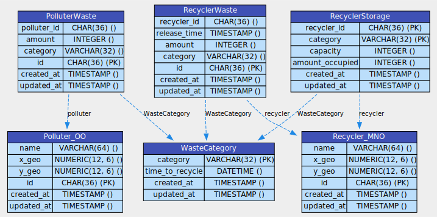

# Как использовать, развёртывать
### Devmode
#создать venv и пакеты установить\
python3 -m venv myenv\
source myenv/bin/activate\
pip install -r req.txt\

в postgres создать БД Atom_eco, с у/з root:root\

если хочется перегенерировать схему таблиц - нужны пакеты:\
sudo apt-get install graphviz\
sudo apt-get install --reinstall xdg-utils\

#создание иллюстрации со схемой таблиц\
python3 -m db-visualizer.db-visualizer # перегенерировать схему таблиц - data_model_diagram.svg\

#запуск приложения\
python3 mock_tables.py # заполнить таблицы мок-данными\
python3 main.py        # запустить приложение\

далее в админке http://127.0.0.1:8001/api/v1.0/admin/ (как фронт у меня) можно посмотреть на очередь отходов организаций(PolluterWastes), заполненность мест накопления отходов (Recycler Storages), а также какие отходы сейчас находятся в хранилищах и сколько им ещё осталось до полной пререработки (Recycler Wastes)\

отходы циркулируют в таком порядке: PolluterWastes -> Recycler Storages -> Recycler Wastes -> переработаны, в Recycler Storages вновь освободилось место и оно готово принимать отходы\

всю логику перераспределения, удаления, обновления берёт на себя демон-обработчик, а клиентам достаточчно просто положить свои отходы в очередь (PolluterWastes) из которой демон их забирёт и распределит оптимально\

### Уведеть и добавить сущности удобно через Swager UI - http://127.0.0.1:8001/docs
также можно добавить новых отходов организаций и ячеек храннения через вызов asyncio.run(MockAtomEco.OO_MNO_wastes_populate()) из mock_tables.py, но тогда нужно перезагрузить main.py т.к. у моков нет IPC синхронизации с десоном, в отличии от ручек API по добавлению сущностей\

# Prodmode
- Dockercompose - надеюсь я успею его написать

# DB schema:

# Frontend-like admin-page
http://127.0.0.1:8001/api/v1.0/admin/

Here you can see queue of PolluterWastes, how they move to RecyclerWastes and how RecylerStorage reacts on it
- once waste is recyled (by timer) - RecyclerStorage gets it`s resources back

- admin page is buggy, but works fine as frontend to monitor entities
- to generate entities - use mock (see section bellow)

# About Demon and muliprocessing
App/backend - parent\
RecyclerDemon - child\
RecyclerDemon stores db in memory and manages waste redestribution and recycling (deletes wastes from recycler storage slots when it`s time)\
RecyclerDemon - loads DB only once - when runned\
than App gives updated data to Recycler_Demon through IPC-queury of commands - feeds demon updates\

Also RecyclerDemon maintanes and populates cache with distances between pollutors and recyclers, btw distances stores squared (not to count radical - just to have ability to range avaliable recyclers by distance) \
 
The DB Table RecyclerWastes (queue of wastes being recycled in recycler\`s storage slots) - fully under Demon`s controll, no one else modifies it

# Docs
http://127.0.0.1:8001/docs

# Mocking tables with data:
python3 mock_tables.py
- also will be api mock-methods to add some random wastes or recyclers

# Draw graph of DB:
from repo`s folder run:
- python3 -m db-visualizer.db-visualizer

# Required packages
for drawing grah of DB:
- sudo apt-get install graphviz
- sudo apt-get install --reinstall xdg-utils

# \[Experimental/for-future\] Rendering graphs:
i`ve managed to constract suitable api for visualazing relationships between objects
- maby in future i`ll find some usecases for it - see app.rel_graph.py

Requirments to use it:
- apt-get install libbz2-dev 

than reinstall current python version (3.12.1 in my case)\
bc python can`t see libbz2-dev without reinstalation: https://stackoverflow.com/questions/27727919/pythonbrew-importing-bz2-yields-importerror-no-module-named-bz2
- pyenv uninstall 3.12.1
- pyenv install 3.12.1

now app/rel_graph.py should work fine (it`s API can be used from mocks or some route)
python3 app/rel_graph.py 

